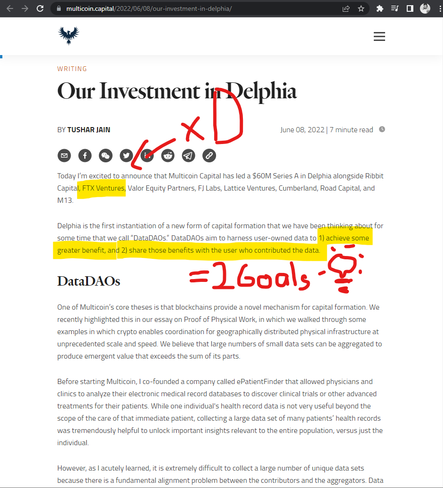
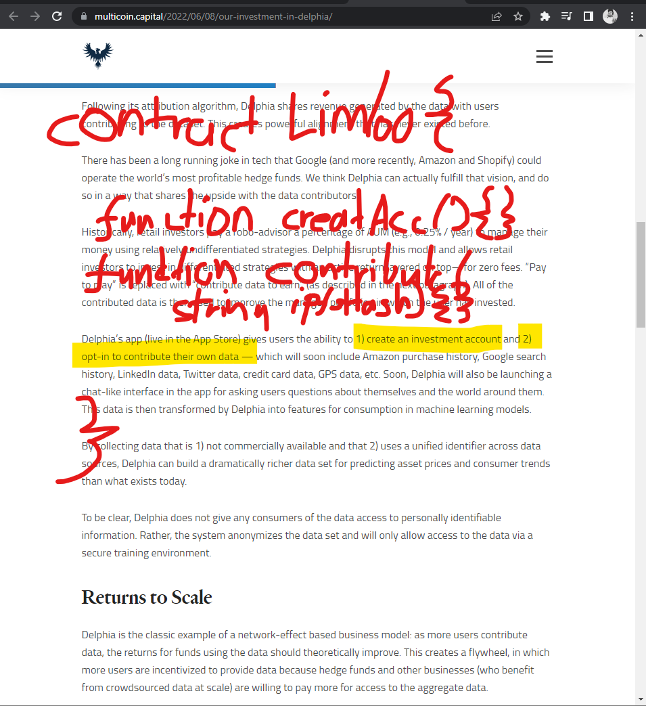

### Pedro
Haha
Guys, are we doing a NFT, right?
Photograph+Person Story = NFT?
Well, I already sent the application
and I got accepted

### Frank

Yeah we can, its not decided, but most likely the article, will be an NFT and the Membership or whatever will be a coin. If you are holding 20 coins you are able to view the following NFTs, if you are holding 100 coins you are able to view to other follwoing content, every coin holder is able to join discord. You can get coins thruh writting comments or if you are total bad ass you write some content and get billions of token, but than you can exchange them for achievments, like a picture of a frog or something. 

Like always a mixture of gametheory, ecconomics and some good amount of good intentions.

Just an example, to say NFT'S alis ERC721 Token is most likely the article represtation 

BUTThe only thing that we know so far that we will work with markdown files and create a Data Dao(whatever that is, maybe i should google it🙈 )

### Julian

https://multicoin.capital/2022/06/08/our-investment-in-delphia/ multicoin kind of coined the term DATA Dao.

For me, it is any app where users own their own data. (Ceramic is a good building block for that)

From their website: "We believe that large numbers of small data sets can be aggregated to produce emergent value that exceeds the sum of its parts...Data contributors are rarely rewarded for their contributions (beyond their own care) because they don’t have a right to the value created by the aggregate data, nor are they entitled to govern how their data is used, which leads to a massive leap of faith in the aggregator—which, unfortunately, has been violated many times over. DataDAOs solve this misalignment by giving data contributors direct economic upside in the aggregate data and the ability to govern it."

### Frank

Thats what I found the most useful information, besides the whole article in itself😁

### Julian

btw just thought of Dataverse by Ownership Labs which fits that DATA Dao category somewhat. They enable you to collect, curate pics, NFTs in your own personal space/storage - also building on Ceramic. maybe you can take something from it https://dataverse.art/ & https://github.com/ownership-labs

### Frank 

Intresting

Basically make a Contract which works as a box.
The box is owned by a person
The DAO is a list of Members
Every Member has a Box (or even a collection of Boxes.)
Each Box is filled with unique Content 

🤔

